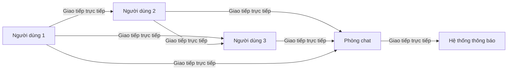
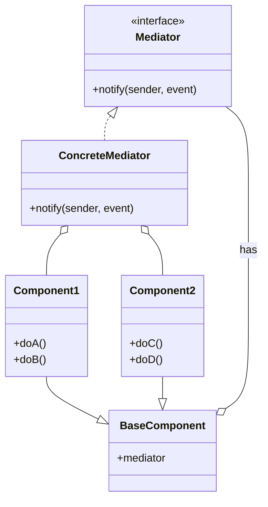
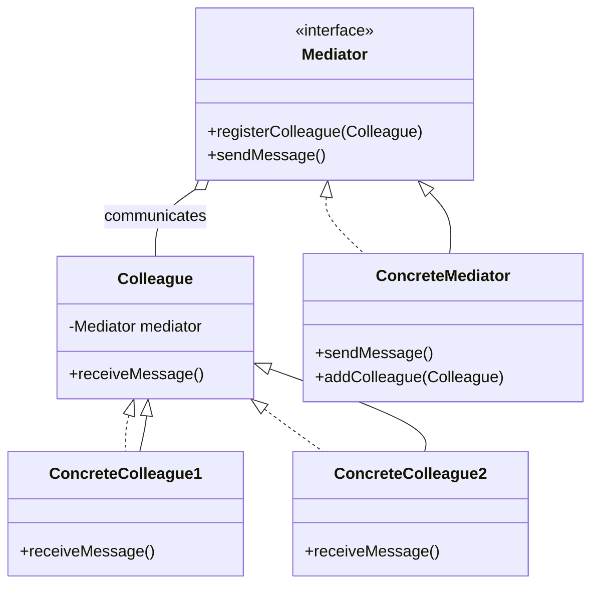
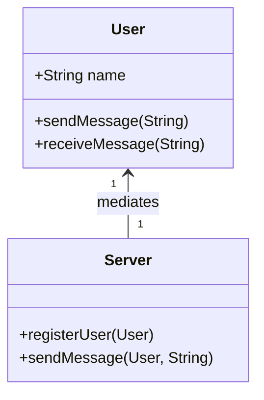

# Mediator

## Khái Niệm

**Mediator Pattern**, trong lĩnh vực phát triển phần mềm, là một mẫu thiết kế hành vi. Nó giúp giảm sự phức tạp trong giao tiếp giữa nhiều đối tượng hoặc lớp bằng cách cung cấp một đối tượng trung gian, gọi là 'mediator'. Điều này giúp các đối tượng không giao tiếp trực tiếp với nhau, mà thông qua mediator, từ đó giảm thiểu sự phụ thuộc lẫn nhau và làm cho mã nguồn dễ bảo trì hơn.

### Tổng quan

- **Định Nghĩa của Pattern:** Mediator Pattern giới thiệu một đối tượng trung gian, gọi là 'Mediator', có nhiệm vụ điều phối giao tiếp giữa các đối tượng khác trong hệ thống. Mục tiêu là giảm sự phụ thuộc trực tiếp giữa các đối tượng, giúp giảm sự phức tạp trong quá trình phát triển và bảo trì.

- **Mục Đích:** Mục đích chính của Mediator Pattern là tạo ra một kênh giao tiếp trung tâm để các đối tượng có thể giao tiếp mà không cần biết về sự tồn tại của nhau. Điều này tạo điều kiện cho việc mở rộng và bảo trì hệ thống trở nên dễ dàng hơn.

- **Ý Tưởng Cốt Lõi:** Trong Mediator Pattern, 'Mediator' đóng vai trò là trung tâm điều phối. Nó giúp các đối tượng tương tác với nhau một cách gián tiếp và giảm thiểu sự phụ thuộc chặt chẽ, từ đó làm cho cấu trúc hệ thống trở nên linh hoạt và dễ quản lý hơn.

### Đặt vấn đề

- **Bối cảnh**: Trong lập trình hướng đối tượng, một vấn đề phổ biến xảy ra khi nhiều lớp tương tác với nhau trực tiếp, tạo ra một mạng lưới phức tạp của các quan hệ. Điều này không chỉ làm cho hệ thống khó hiểu và khó bảo trì, mà còn gây ra sự phụ thuộc lẫn nhau giữa các lớp, làm giảm khả năng tái sử dụng của chúng. Ví dụ, trong một ứng dụng chat, các đối tượng như người dùng, phòng chat, và hệ thống thông báo cần giao tiếp liên tục. Nếu mỗi đối tượng trực tiếp gọi các phương thức của đối tượng khác, mã sẽ nhanh chóng trở nên rối rắm và khó quản lý.


### Giải pháp

- **Cách tiếp cận**: Mediator Pattern giải quyết vấn đề này bằng cách giới thiệu một đối tượng trung gian, gọi là 'Mediator', để quản lý cách các đối tượng tương tác với nhau. Thay vì giao tiếp trực tiếp, các lớp sẽ gửi và nhận yêu cầu thông qua Mediator. Trong ví dụ ứng dụng chat, Mediator có thể là một đối tượng quản lý các phòng chat, xử lý việc gửi thông điệp giữa người dùng và thông báo tới hệ thống thông báo.




- **Lợi ích**: Lợi ích lớn nhất của Mediator Pattern là giảm sự phụ thuộc lẫn nhau giữa các lớp, làm cho mã nguồn dễ đọc và bảo trì hơn. Nó cũng giúp tăng cường khả năng tái sử dụng của các lớp bằng cách giảm sự cố định của chúng vào các lớp khác. Điều này tạo điều kiện cho việc mở rộng và bảo trì hệ thống trở nên dễ dàng hơn.
- **Sự đánh đổi**: Mặt trái của Mediator Pattern là có thể làm tăng độ phức tạp của hệ thống do thêm một lớp trung gian. Nếu mediator trở nên quá phức tạp, nó có thể trở thành điểm nghẽn trong hệ thống. Do đó, cần cân nhắc kỹ lưỡng khi áp dụng pattern này, đặc biệt trong các hệ thống lớn và phức tạp.

## Cấu trúc



- Mediator: định nghĩa interface để giao tiếp với các Colleague.

- Colleague: giao tiếp với mediator thay vì giao tiếp trực tiếp với các Colleague khác.

- ConcreteMediator: triển khaiMediator để điều phối các Colleague.

- ConcreteColleague: các lớp cụ thể tương tác với mediator.

## Cách triển khai

Trong ví dụ này, `ConcreteMediator` quản lý thông điệp giữa các `Colleague`. Mỗi `ConcreteColleague` sẽ gửi và nhận thông điệp thông qua `Mediator`, giúp giảm sự phụ thuộc trực tiếp giữa các đối tượng `Colleague`.

### Bước 1: Tạo Interface `Mediator`

```typescript
interface Mediator {
    registerColleague(colleague: Colleague): void;
    sendMessage(message: string, originator: Colleague): void;
}
```

### Bước 2: Tạo Class Abstract `Colleague`

```typescript
abstract class Colleague {
    protected mediator: Mediator;

    constructor(mediator: Mediator) {
        this.mediator = mediator;
    }

    abstract receiveMessage(message: string): void;
}
```

### Bước 3: Tạo Class `ConcreteMediator`

```typescript
class ConcreteMediator implements Mediator {
    private colleagues: Colleague[] = [];

    registerColleague(colleague: Colleague): void {
        this.colleagues.push(colleague);
    }

    sendMessage(message: string, originator: Colleague): void {
        for (const colleague of this.colleagues) {
            // Don't notify the originator
            if (colleague !== originator) {
                colleague.receiveMessage(message);
            }
        }
    }
}
```

### Bước 4: Tạo Class `ConcreteColleague1` và `ConcreteColleague2`

```typescript
class ConcreteColleague1 extends Colleague {
    constructor(mediator: Mediator) {
        super(mediator);
    }

    receiveMessage(message: string): void {
        console.log(`ConcreteColleague1 received: ${message}`);
    }
}

class ConcreteColleague2 extends Colleague {
    constructor(mediator: Mediator) {
        super(mediator);
    }

    receiveMessage(message: string): void {
        console.log(`ConcreteColleague2 received: ${message}`);
    }
}
```

### Bước 5: Demo Sử Dụng

```typescript
const mediator: Mediator = new ConcreteMediator();

const colleague1: Colleague = new ConcreteColleague1(mediator);
const colleague2: Colleague = new ConcreteColleague2(mediator);

mediator.registerColleague(colleague1);
mediator.registerColleague(colleague2);

mediator.sendMessage("Hello from Colleague1", colleague1);
mediator.sendMessage("Hello from Colleague2", colleague2);
```

## Ví dụ

Mediator Pattern là một mẫu thiết kế hành vi giúp giảm sự phức tạp trong giao tiếp giữa các đối tượng hoặc lớp bằng cách cung cấp một lớp trung gian, gọi là "mediator". Mediator này kiểm soát cách thức giao tiếp giữa các đối tượng và hỗ trợ việc loại bỏ sự phụ thuộc lẫn nhau giữa chúng, làm cho mã nguồn dễ quản lý và bảo trì hơn.

Trong ví dụ sau, chúng ta xây dựng một hệ thống chat đơn giản, trong đó các người dùng (User) gửi tin nhắn cho nhau thông qua một Mediator là Server. Mỗi người dùng không trực tiếp giao tiếp với người dùng khác, mà thông qua Server. Điều này giúp dễ dàng thay đổi hoặc mở rộng logic giao tiếp mà không cần thay đổi trong các lớp người dùng.



1. **Mediator Interface và Concrete Mediator**:
   Đầu tiên, ta định nghĩa interface `ChatMediator` và lớp cụ thể `ChatServer` thực thi nó.

    ```typescript
    interface ChatMediator {
        sendMessage(msg: string, user: User): void;
        registerUser(user: User): void;
    }
    class ChatServer implements ChatMediator {
        private users: User[] = [];

        registerUser(user: User): void {
            this.users.push(user);
        }

        sendMessage(msg: string, user: User): void {
            for (const u of this.users) {
                // message should not be received by the user sending it
                if (u !== user) {
                    u.receiveMessage(msg);
                }
            }
        }
    }
    ```

2. **Colleague Classes**:
   Tiếp theo, ta tạo lớp `User` mô tả các thành viên tham gia vào hệ thống chat.

    ```typescript
    class User {
    private name: string;
    private mediator: ChatMediator;

    constructor(name: string, mediator: ChatMediator) {
        this.name = name;
        this.mediator = mediator;
    }

    sendMessage(msg: string): void {
        console.log(`${this.name}: Sending Message = ${msg}`);
        this.mediator.sendMessage(msg, this);
    }

    receiveMessage(msg: string): void {
        console.log(`${this.name}: Received Message = ${msg}`);
    }
  }
    ```

3. **Sử dụng Mediator Pattern**:
   Cuối cùng, ta tạo các đối tượng User và Server và thử nghiệm giao tiếp giữa chúng.

    ```typescript
    const mediator: ChatMediator = new ChatServer();

    const user1: User = new User('Alice', mediator);
    const user2: User = new User('Bob', mediator);

    mediator.registerUser(user1);
    mediator.registerUser(user2);

    user1.sendMessage('Hi Bob!');
    user2.sendMessage('Hey Alice!');
    ```

Trong đoạn code trên, `ChatServer` đóng vai trò là mediator, quản lý việc gửi tin nhắn giữa các `User`. Các `User` không giao tiếp trực tiếp với nhau mà thông qua `ChatServer`.

## Khi nào nên sử dụng Mediator Pattern

- **Khi bạn muốn giảm sự phụ thuộc lẫn nhau giữa các lớp hoặc các module**: Mediator Pattern giúp các lớp hoặc module không trực tiếp giao tiếp với nhau, mà thông qua một "trung gian", giảm sự phụ thuộc và tăng khả năng tái sử dụng.

- **Khi hệ thống của bạn có quá nhiều giao tiếp trực tiếp giữa các đối tượng và bạn muốn quản lý hoặc giảm thiểu sự phức tạp này**: Mediator Pattern tập trung giao tiếp giữa các đối tượng vào một điểm duy nhất, làm cho quản lý và hiểu hệ thống trở nên dễ dàng hơn.

- **Trong các ứng dụng muốn cung cấp khả năng mở rộng cao**: Khi sử dụng Mediator, việc thêm hoặc sửa đổi các thành phần của hệ thống trở nên dễ dàng hơn mà không làm ảnh hưởng đến các thành phần khác.

- **Khi cần đảm bảo sự cô lập giữa các thành phần của hệ thống**: Mediator giúp các thành phần giữ được sự độc lập, giảm thiểu rủi ro khi một phần của hệ thống thay đổi hoặc gặp sự cố.

- **Trong việc xây dựng các ứng dụng GUI**: Mediator thường được sử dụng trong các ứng dụng giao diện người dùng để quản lý sự tương tác giữa các thành phần GUI, giúp giảm sự phức tạp trong quản lý sự kiện và trạng thái.
