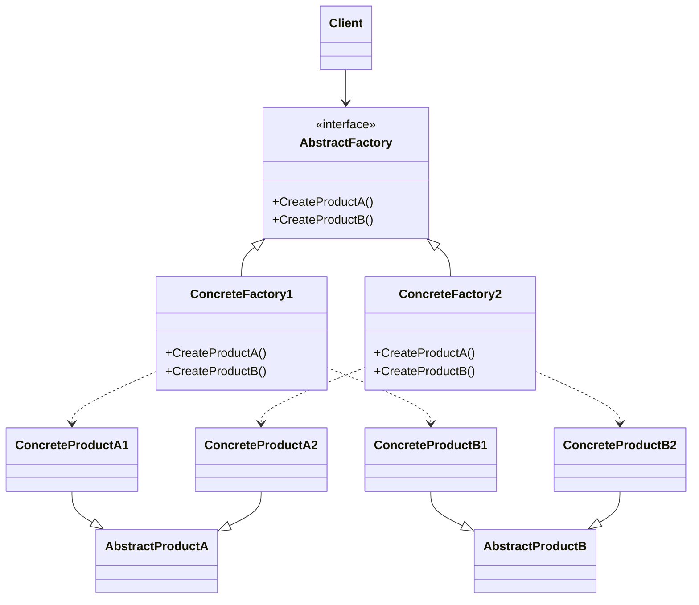

# Abstract Factory

## Giới thiệu

Trong cuốn sách về Design Pattern, chúng ta đã tìm hiểu về nhóm Creational Pattern, bao gồm những Pattern giúp khởi tạo đối tượng một cách linh hoạt và thuận tiện. Factory Method là một Pattern đã được giới thiệu, giúp tạo ra các đối tượng của một lớp. Tuy nhiên, trong nhiều trường hợp, các đối tượng có quan hệ với nhau và được nhóm thành các họ. Lúc này, chúng ta cần Abstract Factory.

Abstract Factory cung cấp một interface để tạo ra các họ đối tượng liên quan với nhau một cách linh hoạt.

## Đặt vấn đề

Giả sử bạn đang phát triển một ứng dụng gọi món ăn cho nhà hàng. Các món ăn được phân thành các nhóm:

- Món lẩu: Thịt bò, rau củ, nấm hương
- Món phở: Bánh phở, thịt bò, giá đỗ
- Món bún: Bún, nem nuong, chả giò

Khi người dùng gọi món, các nguyên liệu cần được chuẩn bị phù hợp với nhau trong cùng một nhóm món.

Ngoài ra, nhà hàng thường xuyên thay đổi thực đơn, bổ sung các nhóm món mới.

Chúng ta cần một cách để dễ dàng tạo ra và thay đổi các nhóm món mà không ảnh hưởng đến code hiện tại.

## Giải quyết

Để giải quyết vấn đề trên, Abstract Factory đưa ra ý tưởng:

- Tạo interface định nghĩa các phương thức tạo các loại nguyên liệu trừu tượng: thịt, rau, carb, ...

- Tạo các Concrete Factory triển khai interface này, mỗi Factory tương ứng với một nhóm món, chịu trách nhiệm tạo ra các nguyên liệu phù hợp.

- Code sẽ sử dụng Abstract Factory để lấy các nguyên liệu một cách tổng quát.

Như vậy, khi thêm nhóm món mới, chỉ cần tạo thêm Concrete Factory tương ứng, mà không làm ảnh hưởng code hiện tại.

## Cấu trúc

Abstract Factory có cấu trúc gồm các thành phần chính sau:



- Abstract Factory interface: định nghĩa các phương thức nhà máy trừu tượng để tạo ra các sản phẩm trừu tượng.
- Concrete Factory: cài đặt các phương thức nhà máy cụ thể để tạo ra các sản phẩm cụ thể. Mỗi Concrete Factory tạo ra một tập sản phẩm khác biệt, phù hợp với một variant.
- Abstract Product: định nghĩa interface chung cho một loại sản phẩm trừu tượng.
- Concrete Product: cài đặt các sản phẩm cụ thể, triển khai từ Abstract Product. Mỗi sản phẩm thuộc về một Concrete Factory nhất định.
- Client: sử dụng Abstract Factory và Abstract Product để tương tác với hệ thống. Không cần quan tâm đến các lớp cụ thể.

## Cách triển khai

Đầu tiên, ta định nghĩa interface AbstractFactory:
```typescript
interface AbstractFactory {
  createProductA(): AbstractProductA;
  createProductB(): AbstractProductB;
}

```
Tiếp theo, định nghĩa các Concrete Factory triển khai AbstractFactory:
```typescript
class ConcreteFactory1 implements AbstractFactory {

  createProductA(): AbstractProductA {
    return new ConcreteProductA1();
  }

  createProductB(): AbstractProductB {
    return new ConcreteProductB1();
  }

}

class ConcreteFactory2 implements AbstractFactory {

  createProductA(): AbstractProductA {
    return new ConcreteProductA2();
  }

  createProductB(): AbstractProductB {
    return new ConcreteProductB2();
  }

}

```

Định nghĩa các Abstract Product dưới dạng interface:

```typescript
interface AbstractProductA {
  methodA(): void;
}

interface AbstractProductB {
  methodB(): void;
}

```

Triển khai các Concrete Product từ Abstract Product:

```typescript
class ConcreteProductA1 implements AbstractProductA {
  methodA(): void {
    console.log("ConcreteProductA1: methodA");
  }
}

class ConcreteProductB1 implements AbstractProductB {
  methodB(): void {
    console.log("ConcreteProductB1: methodB");
  }
}

class ConcreteProductA2 implements AbstractProductA {
  methodA(): void {
    console.log("ConcreteProductA2: methodA");
  }
}

class ConcreteProductB2 implements AbstractProductB {
  methodB(): void {
    console.log("ConcreteProductB2: methodB");
  }
}

```

Cuối cùng, ở Client chúng ta sẽ sử dụng AbstractFactory để tạo ra các Abstract Product mà không cần quan tâm đến các lớp cụ thể:

```typescript
class Main {

  public static main(): void {

    // Khởi tạo factory 
    let factory: AbstractFactory = new ConcreteFactory1();

    // Sử dụng factory để lấy các sản phẩm
    let productA: AbstractProductA = factory.createProductA();
    let productB: AbstractProductB = factory.createProductB();

    // Sử dụng các sản phẩm 
    productA.methodA();
    productB.methodB();

    // Thay đổi factory khác
    factory = new ConcreteFactory2();

    // Lấy lại các sản phẩm 
    productA = factory.createProductA();
    productB = factory.createProductB();

    // Sử dụng các sản phẩm mới
    productA.methodA();
    productB.methodB();
  }

}

// Thực thi hàm main
Main.main();

```
## Ví dụ

Dưới đây là một ví dụ minh họa về Abstract Factory trong Typescript:


```typescript
// Interface for Protein
interface IProtein {
  prepare(): void;
}

// Interface for Carbohydrate
interface ICarbohydrate {
  prepare(): void;
}

// Abstract Factory Interface
interface FoodFactory {
  createProtein(): IProtein;
  createCarbohydrate(): ICarbohydrate;
}

// Concrete implementation of Protein for Lau
class LauProtein implements IProtein {
  prepare(): void {
    console.log("Preparing Lau Protein");
  }
}

// Concrete implementation of Carbohydrate for Lau
class LauCarbohydrate implements ICarbohydrate {
  prepare(): void {
    console.log("Preparing Lau Carbohydrate");
  }
}

// Concrete Factory for Lau
class LauFactory implements FoodFactory {
  createProtein(): IProtein {
    return new LauProtein();
  }

  createCarbohydrate(): ICarbohydrate {
    return new LauCarbohydrate();
  }
}

// Client code
class Client {
  public static main(): void {
    const factory: FoodFactory = new LauFactory();
    const protein: IProtein = factory.createProtein();
    const carb: ICarbohydrate = factory.createCarbohydrate();

    protein.prepare();
    carb.prepare();
  }
}

// Execute the client code
Client.main();

```
Chương trình sẽ in ra các bước chuẩn bị cho từng thành phần món lẩu. Bạn có thể dễ dàng thêm các nhóm món khác bằng cách tạo thêm Concrete Factory.

## So sánh

Abstract Factory có thể được so sánh với một số Design Pattern tương tự như:

- Factory Method: Factory Method chỉ cung cấp phương thức factory để tạo ra đối tượng của một lớp cụ thể. Trong khi đó, Abstract Factory cung cấp interface để tạo ra toàn bộ họ các đối tượng liên quan.

- Builder Pattern: Builder tập trung vào việc tạo ra một đối tượng phức tạp bằng cách tách quá trình xây dựng ra khỏi biểu diễn. Abstract Factory tập trung vào việc tạo ra các đối tượng thuộc cùng một họ liên quan.

- Prototype Pattern: Prototype tạo ra đối tượng bằng cách clone đối tượng ban đầu. Abstract Factory tạo ra đối tượng mới mỗi lần được gọi.

- Singleton Pattern: Singleton chỉ cho phép tồn tại duy nhất một instance. Abstract Factory tạo nhiều đối tượng khác nhau.

## Kết luận

Abstract Factory là một Design Pattern hữu ích, có một số ưu điểm sau:

- Tách biệt phần triển khai với phần sử dụng code, giảm sự phụ thuộc lẫn nhau giữa các đối tượng.

- Có thể dễ dàng thay đổi, mở rộng cách tạo đối tượng mà không ảnh hưởng đến phần còn lại của code.

- Giúp tạo ra các họ đối tượng liên quan một cách thống nhất.

Tuy nhiên, Pattern cũng có một số nhược điểm cần lưu ý:

- Cấu trúc phức tạp, nhiều lớp trừu tượng cần phải triển khai.

- Khó khăn trong việc cân bằng giữa tính linh hoạt và hiệu suất.

Vì vậy, Abstract Factory phù hợp trong trường hợp cần tạo ra các họ đối tượng liên quan, có tính mở rộng cao. Không nên sử dụng nếu chỉ cần tạo đơn giản một Object.

Như vậy, với ưu điểm về tính linh hoạt và mở rộng, Abstract Factory là một Pattern rất hữu ích, phổ biến trong thiết kế phần mềm.
